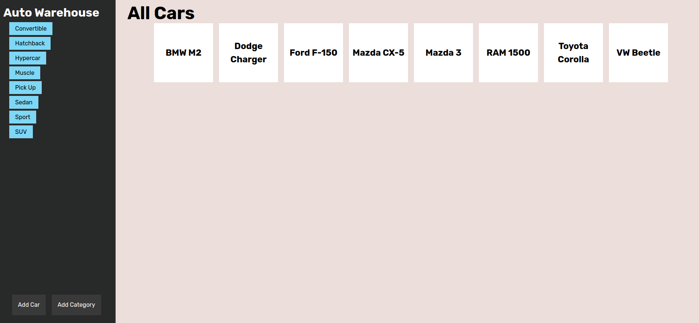

# inventory-app

>  [Live Website](https://inventory-app-production-c510.up.railway.app/)

## Preview



## Tools/Languages

[](#)  [](#)  [](#)

[](#)  [](#) [](#)


## Getting Started

```
$ git clone git@github.com:immacheetah/inventory-app.git
$ cd inventory-app
$ npm install
$ npm run start

```

## Learning Outcomes

- How to create a database from scratch
- Build relational database
- Run queries between multiple tables
- Split up controller and routes
- Error handling with try/catch blocks 
    - Sending error to error middleware
- Form validation using express validator
